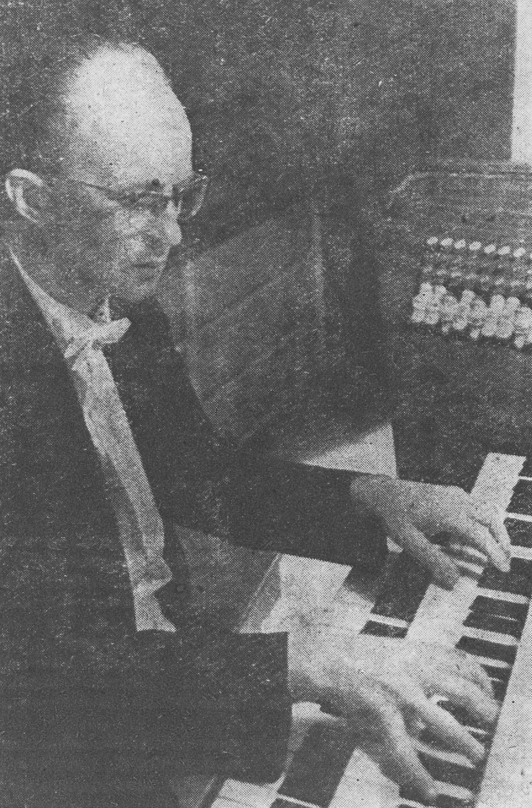

---
#
# By default, content added below the "---" mark will appear in the home page
# between the top bar and the list of recent posts.
# To change the home page layout, edit the _layouts/home.html file.
# See: https://jekyllrb.com/docs/themes/#overriding-theme-defaults
#
layout: home
---
<!-- <figure>
    
    <figcaption>Vratislav Bělský</figcaption>
</figure> -->

<!--  -->

Varhaník, cembalista a pedagog <strong>Vratislav Bělský</strong> (1924–2003) se po celý tvůrčí život věnoval především hudbě 17. a 18. století a její interpretaci. Pocházel z České Třebové, z rodiny malíře a pedagoga Františka Václava Bělského. Od dob studia na konzervatoři však působil v Brně, kde patřil k nejvýraznějším osobnostem hudebního života. Hudbu baroka a klasicismu provozoval od mládí na koncertech, ať už jako sólový varhaník a cembalista, tak jako interpret continua a komorní hráč. Zvláště významné je jeho působení v souboru Collegium musicum brunense (později nesoucí název Čeští komorní sólisté), jehož členem byl od jeho založení v roce 1949. Také se podílel na přípravě repertoáru pro ansámbl. Bělského interpretační záběr byl však mnohem širší. S nemenší intenzitou se totiž věnoval také hudbě pozdějších období, včetně hudby soudobé. S jeho interpretačními aktivitami úzce souvisela jeho činnost ediční. Bělský připravoval kritické edice hudby českých skladatelů 17. a 18. století, z nichž mnohé byly vydány především v rámci řady Musica Antiqua Bohemica. Mimořádnou pozornost věnoval odkazu Jana Dismase Zelenky.

Vratislav Bělský působil na brněnské konzervatoři a později na Janáčkově akademii múzických umění, kde vychoval řadu vynikajících varhaníků (např. Josefa Kšicu či Petra Kolaře). Současně svými znalostmi a praktickými zkušenostmi na poli staré hudby přímo ovlivnil řadu mladých hudebníků, kteří se posléze stali předními osobnostmi historické interpretace hudby baroka a klasicismu u nás (Robert Hugo, Marek Štryncl, Roman Válek ad.). Bělského zásadními počiny širšího dosahu zůstávají české překlady nejdůležitějších traktátů, sepsaných předními evropskými hudebníky doby baroka a klasicismu (J. J. Quantz, C. Ph. E. Bach a L. Mozart), jejichž znalost je pro interpretaci tzv. staré hudby nezbytná, a to bez ohledu na hudební nástroj. Rovněž Bělského učebnice (Cembalo, Nauka o varhanách, Hudba baroka) neztratily dodnes na aktuálnosti.

---